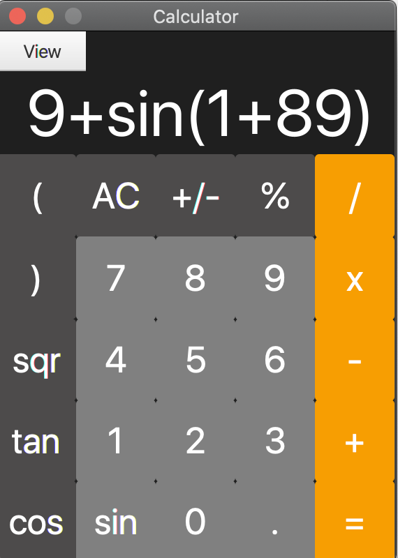
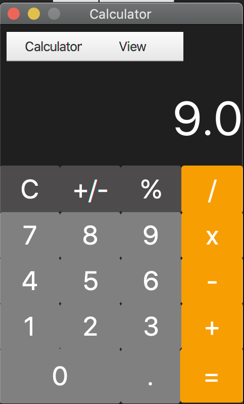

# CalculatorFX
Build a JavaFX Calculator for homework
## TODO
* [x] Beautify the calculator with css.
* [x] Add math expression parser.
* [ ] Add intergal and differential function.
* [ ] Add function drawing function.
* [ ] Write report and add some comments.

## Demo

